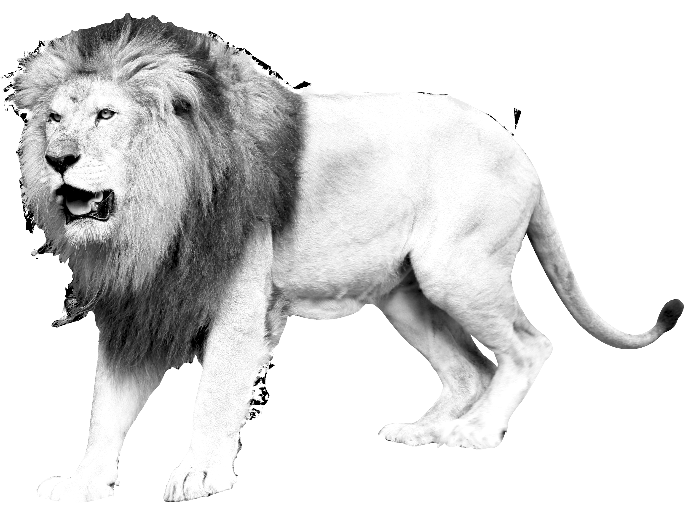
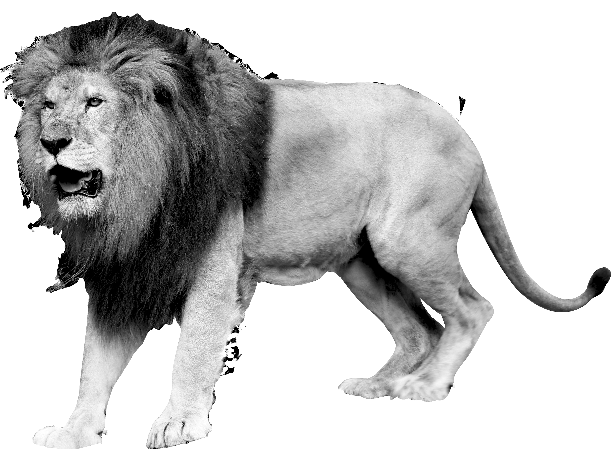
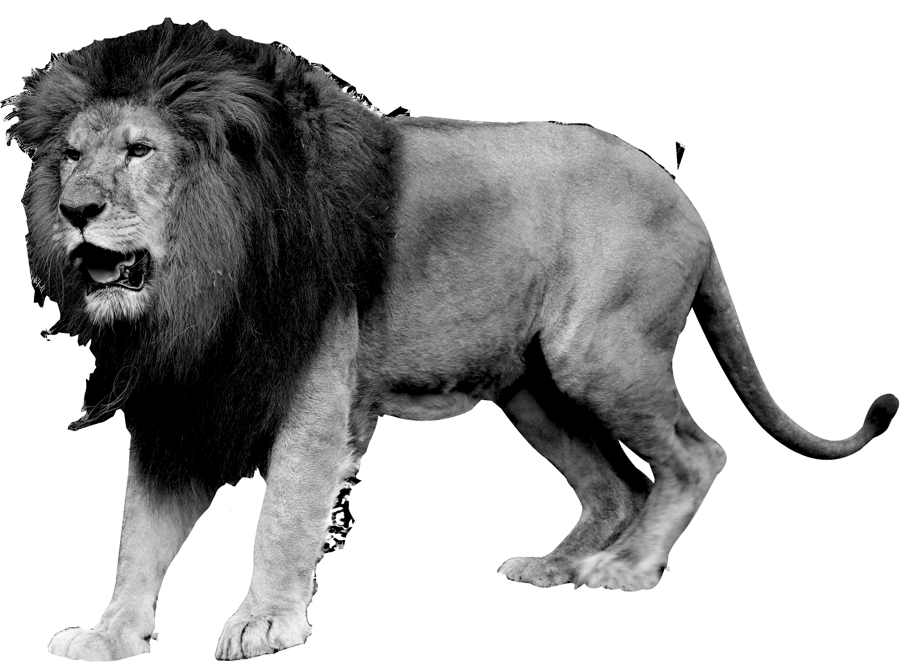
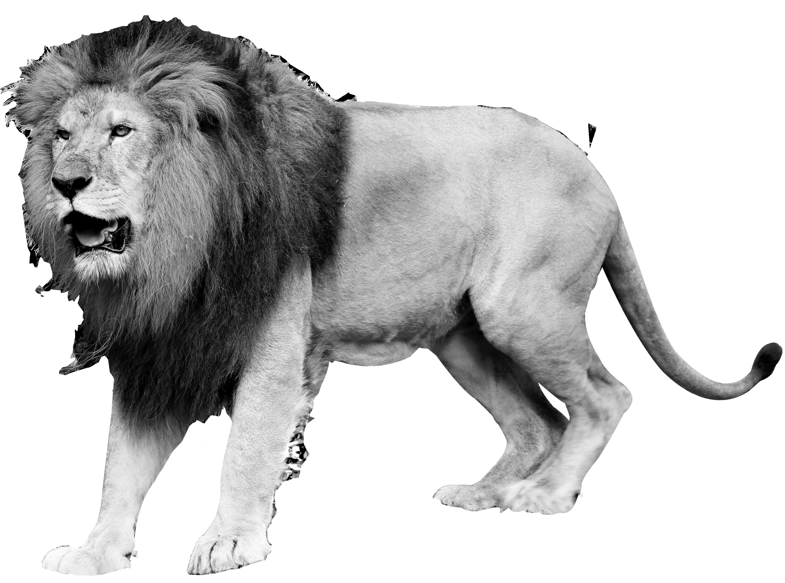
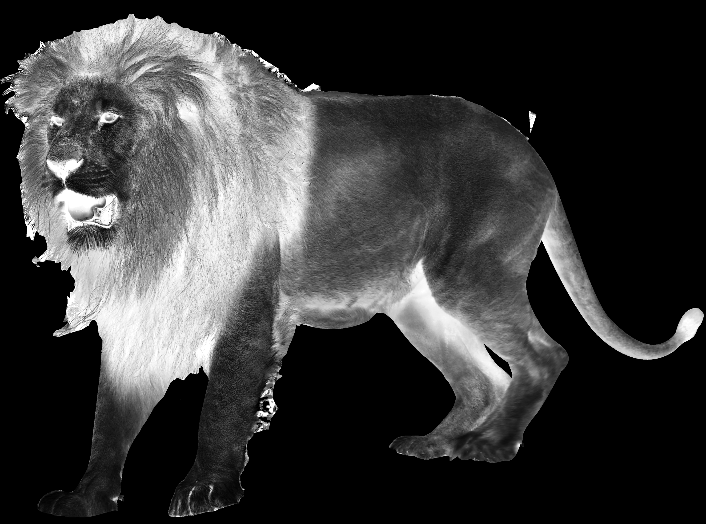
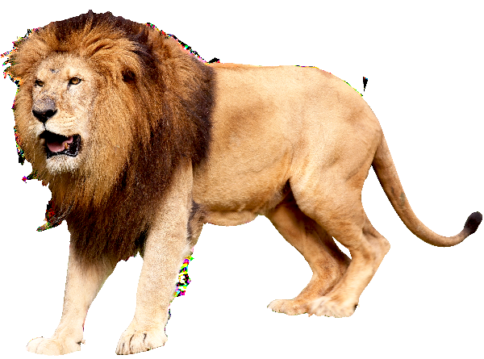

# Лабораторная работа: Цветовые модели и передискретизация изображений

## Описание

В данной лабораторной работе проводятся операции с изображениями, такие как выделение компонент цветов, преобразование в модель HSI, инвертирование яркостной компоненты, а также растяжение и сжатие изображений. 

## Немного теории 

**Метод ближайшего соседа (Nearest Neighbor, NN)** — это один из самых простых и распространенных методов интерполяции, используемый для изменения размера изображений (растяжения или сжатия). Он работает следующим образом:

Основной принцип:
При изменении размера изображения метод ближайшего соседа заменяет каждый пиксель в новом изображении на значение пикселя, который наиболее близко расположен к нему в исходном изображении.

Как это работает:

**Растяжение изображения (увеличение)**: Когда изображение увеличивается, необходимо для каждого нового пикселя найти ближайший пиксель в исходном изображении. Например, если новый пиксель находится между двумя пикселями исходного изображения, метод ближайшего соседа просто выбирает один из них, обычно тот, который ближе всего. Таким образом, не создаются новые значения пикселей, а просто выбираются существующие.

**Сжатие изображения (уменьшение)**: При уменьшении изображения несколько пикселей из исходного изображения объединяются в один пиксель на новом изображении. Метод ближайшего соседа выбирает пиксель, который будет "представлять" группу исходных пикселей, обычно это один пиксель из исходного изображения.
## 1. Цветовые модели

### 1.1 Выделение компонентов R, G, B

**Исходное изображение**

Из исходного изображения выделены компоненты R, G и B, и сохранены как отдельные изображения.

- **R_channel.png** - Красный канал

- **G_channel.png** - Зеленый канал

- **B_channel.png** - Синий канал

### 1.2 Преобразование в модель HSI и сохранение яркостной компоненты

Из исходного изображения был рассчитан яркостной компонент HSI и сохранен как отдельное изображение.

- **I_component.png** - Яркостная компонента

### 1.3 Инвертирование яркостной компоненты

Инвертированное изображение яркостной компоненты было сохранено отдельно.

- **I_inverted.png** - Инвертированная яркостная компонента

## 2. Передискретизация изображений

### 2.1 Растяжение изображения (интерполяция)

Изображение было растянуто в 5 раз с использованием метода ближайшего соседа.

- **stretched_image.png** - Растянутое изображение

### 2.2 Сжатие изображения (децимация)

Изображение было сжато в 5 раз, уменьшая количество пикселей.

- **compressed_image.png** - Сжатое изображение

### 2.3 Передискретизация изображения в два прохода

Изображение было сначала растянуто в 5 раз, а затем сжато в 5 раз.

- **resampled_image.png** - Изображение после двух проходов (растяжение и сжатие)

### 2.4 Передискретизация за один проход

Изображение было передискретизировано в 5 раз за один проход методом ближайшего соседа.
в
- **one_step_resampled_image.png** - Передискретизация за один проход

## Заключение

В ходе выполнения лабораторной работы были успешно выполнены все требуемые операции, включая обработку цветовых каналов, преобразование в модель HSI, инвертирование яркости и различные способы передискретизации изображений.