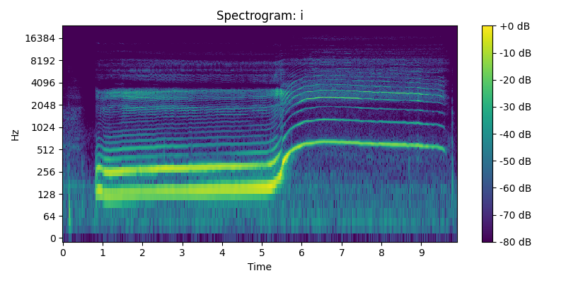
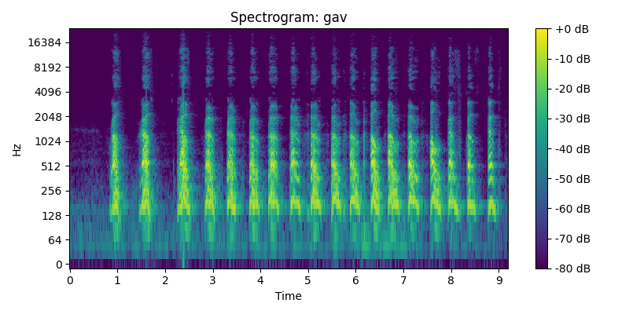
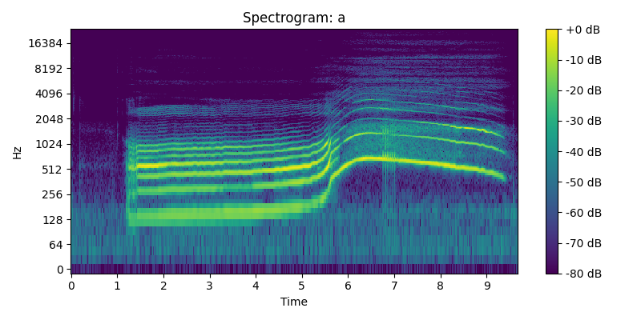

# Лабораторная работа №10. Обработка голоса

## Результаты анализа

| Файл    | Мин. частота (Гц) | Макс. частота (Гц) | Основная частота (Гц) | Обертоны (Гц)         | Форманты (Гц)                      |
|---------|-------------------|--------------------|------------------------|------------------------|------------------------------------|
| **i**   | 23.4              | 3281.2             | 154.3                  | 154.3, 308.7           | 2110.5, 6224.6, 9868.9             |
| **a**   | 23.4              | 2789.1             | 172.7                  | 518.2, 691.0           | 3403.6, 7225.7, 10309.9            |
| **gav** | 23.4              | 1242.2             | 104.5                  | 208.9, 522.3           | 198.4                              |

## Спектрограмма И

## Спектрограмма Лай

## Спектрограмма А

