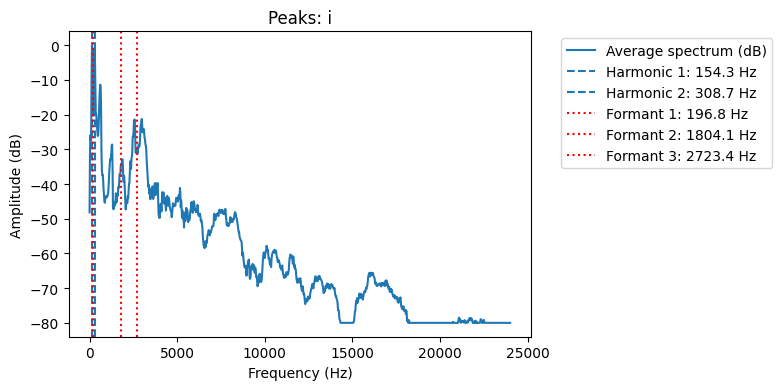
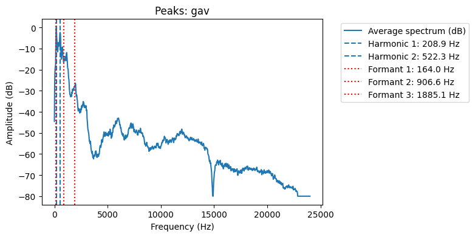
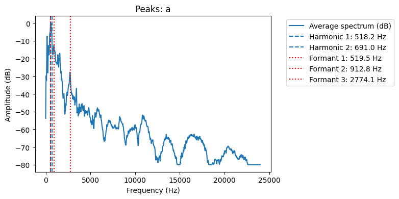

| Файл  | Мин. частота (Гц) | Макс. частота (Гц) | Основная частота (Гц) | Обертоны (Гц)         | Форманты (Гц)                      |
|-------|-------------------|--------------------|------------------------|------------------------|------------------------------------|
| **i** | 23.4              | 3281.2             | 154.3                  | 154.3, 308.7           | 672.8, 24000.0                     |
| **a** | 23.4              | 2789.1             | 172.7                  | 518.2, 691.0           | 746.6, 24000.0, 24000.0            |
| **gav** | 23.4            | 1242.2             | 104.5                  | 208.9, 522.3           | 602.8, 1111.7, 6689.9              |

## Спектрограмма И

## Спектрограмма Лай

## Спектрограмма А

На основе акустического анализа можно сделать следующие выводы. Звук "gav" имеет самую низкую основную частоту (104.5 Гц) и узкий спектральный диапазон (до 1242.2 Гц), что говорит о более низком, грудном тембре и менее выраженной высокочастотной составляющей. В отличие от него, звуки "a" и "i" имеют более высокие основные частоты — 172.7 Гц и 154.3 Гц соответственно — что характерно для более ярких и высоких гласных. У звука "i" наблюдается самый широкий частотный диапазон (до 3281.2 Гц) и ярко выраженные высокие компоненты, что типично для гласной \[i] с узкой артикуляцией. Формантные частоты (резонансные пики) также различаются: для "i" первый формант составляет 672.8 Гц, для "a" — 746.6 Гц, а для "gav" — 602.8 Гц. Эти значения соответствуют открытости и позиции артикуляции звуков. Таким образом, каждый звук демонстрирует уникальные спектральные характеристики, отражающие его фонетическую природу и способ произнесения.
