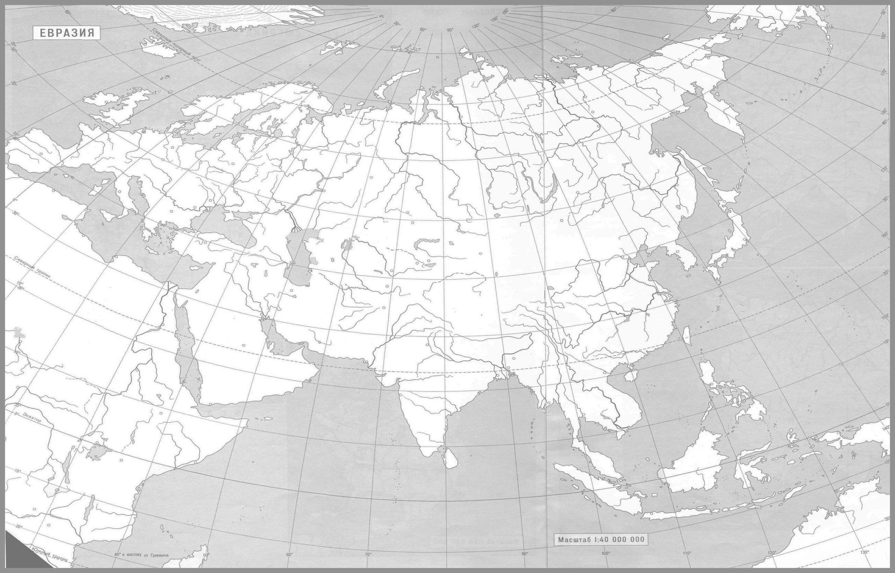

# Лабораторная работа: Обесцвечивание и бинаризация растровых изображений

## Описание

В данной лабораторной работе выполняется преобразование изображений в полутоновые и бинарные изображения с использованием различных методов бинаризации. Для выполнения задания использовались изображения из папки `pictures_scr`, а результаты обработки были сохранены в папку `pictures_results`.

## Примененные методы

1. **Приведение к полутоновому изображению**  
   Для каждого изображения был вычислен яркостный канал, который использовался для преобразования в полутоновое изображение.

2. **Бинаризация с использованием порога**  
   Для каждого полутонового изображения был применен автоматический выбор порога методом Оцу, который вычисляет оптимальный порог для разделения изображения на черный и белый цвета.

3. **Адаптивная бинаризация NICK (окно 3x3)**  
   Для изображений с неравномерным освещением или сложными фонами была использована адаптивная бинаризация, где порог для каждого пикселя вычисляется на основе его окружения (окно 5x5).

## Результаты

### Пример 1: Изображение карты 

#### Исходное изображение:

#### Полутоновое изображение:

#### Адаптивная бинаризация NICK (Окно 3x3):

### Пример 2: Изображение Аниме

#### Исходное изображение:

#### Полутоновое изображение:

#### Адаптивная бинаризация NICK (Окно 3x3):

### Пример 3: Изображение Рентгена

#### Исходное изображение:

#### Полутоновое изображение:

#### Адаптивная бинаризация NICK (Окно 3x3):

## Выводы по адаптивной бинаризации NICK

Адаптивная бинаризация NICK продемонстрировала свою эффективность при обработке изображений с неравномерным освещением или сложными фонами. В отличие от глобальных методов бинаризации, таких как метод Оцу, адаптивная бинаризация NICK вычисляет порог для каждого пикселя на основе его локального окружения (в данном случае использовалось окно 3x3). Это позволяет более точно разделять объекты и фон, особенно в случаях, когда яркость изображения варьируется в разных областях.

### Преимущества адаптивной бинаризации NICK:
1. **Устойчивость к неравномерному освещению**: Метод хорошо справляется с изображениями, где освещение распределено неравномерно, что делает его подходящим для обработки медицинских снимков (например, рентгеновских изображений) или фотографий с тенями.
2. **Сохранение деталей**: Благодаря локальному расчету порога, метод сохраняет мелкие детали на изображении, что особенно важно для обработки текстов, карт или изображений с высокой детализацией.
3. **Гибкость**: Использование окна 3x3 позволяет адаптироваться к локальным изменениям яркости, что делает метод универсальным для различных типов изображений.

### Недостатки адаптивной бинаризации NICK:
1. **Вычислительная сложность**: По сравнению с глобальными методами, адаптивная бинаризация требует больше вычислительных ресурсов, так как порог рассчитывается для каждого пикселя отдельно.
2. **Чувствительность к шуму**: В некоторых случаях метод может быть чувствителен к шуму на изображении, особенно если окно слишком мало.

### Заключение:
Адаптивная бинаризация NICK является мощным инструментом для обработки изображений с неоднородным освещением или сложными текстурами. Однако ее применение требует учета вычислительных затрат и возможной чувствительности к шуму. Для достижения наилучших результатов рекомендуется экспериментировать с размером окна и параметрами метода в зависимости от конкретной задачи.