# Лабораторная работа №3. Фильтрация изображений и морфологические операции

## Описание
В работе выполнялась фильтрация полутоновых изображений с применением морфологической операции "стирание бахромы" (морфологическое открытие) и анализ результатов через разностное изображение. Исходные данные — полутоновые изображения из папки `pictures_src`, результаты сохранены в `pictures_results`.

---

## Примененные методы

### 1. Фильтр "Стирание бахромы"
- **Морфологическое открытие** (эрозия + дилатация) с квадратным структурным элементом 3×3 (черный — нулевые значения). 
- **Цель**: Удаление мелких шумов, "бахромы" и сглаживание контуров без значительного изменения размера объектов.
- **Алгоритм**:
  1. Применить эрозию: уменьшение ярких областей, удаление тонких линий.
  2. Применить дилатацию: восстановление размера объектов, сохранение сглаженных контуров.

### 2. Разностное изображение
- Вычислялось как **модуль разности** между исходным и обработанным изображением:  
  `|I_original - I_processed|`.
- **Цель**: Визуализация удаленных деталей (бахромы, шума).

### 3. Обработка цветных изображений
- Полутоновое изображение получено из цветного через **яркостный канал** (Y = 0.299R + 0.587G + 0.114B).
- Фильтр применен к полутоновой версии, результат наложен на исходное цветное изображение для анализа артефактов.

---

## Результаты

### Пример 1: Изображение лица

#### Исходное:

#### После "стирания бахромы":

#### Разностное изображение:
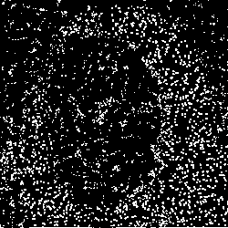

---

### Пример 2: Изображение шахмат

#### Исходное:
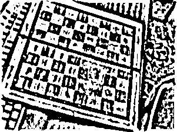

#### После "стирания бахромы":
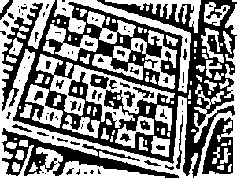

#### Разностное изображение:
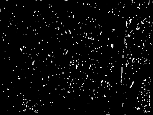

---

### Пример 3: Цветное дома

#### Исходное:

#### После "стирания бахромы":
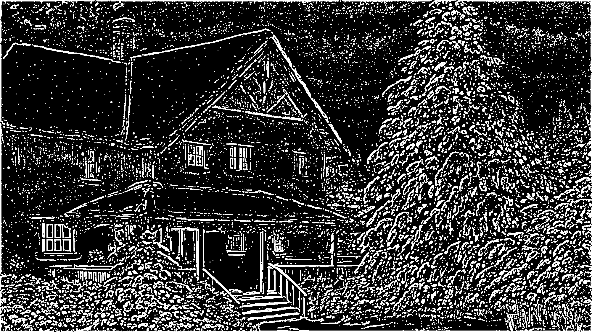

#### Разностное изображение:
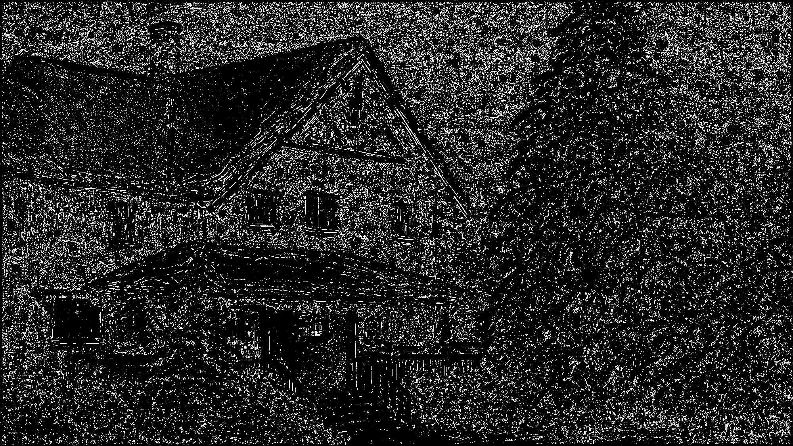

### Пример 5: X-ray

#### Исходное:
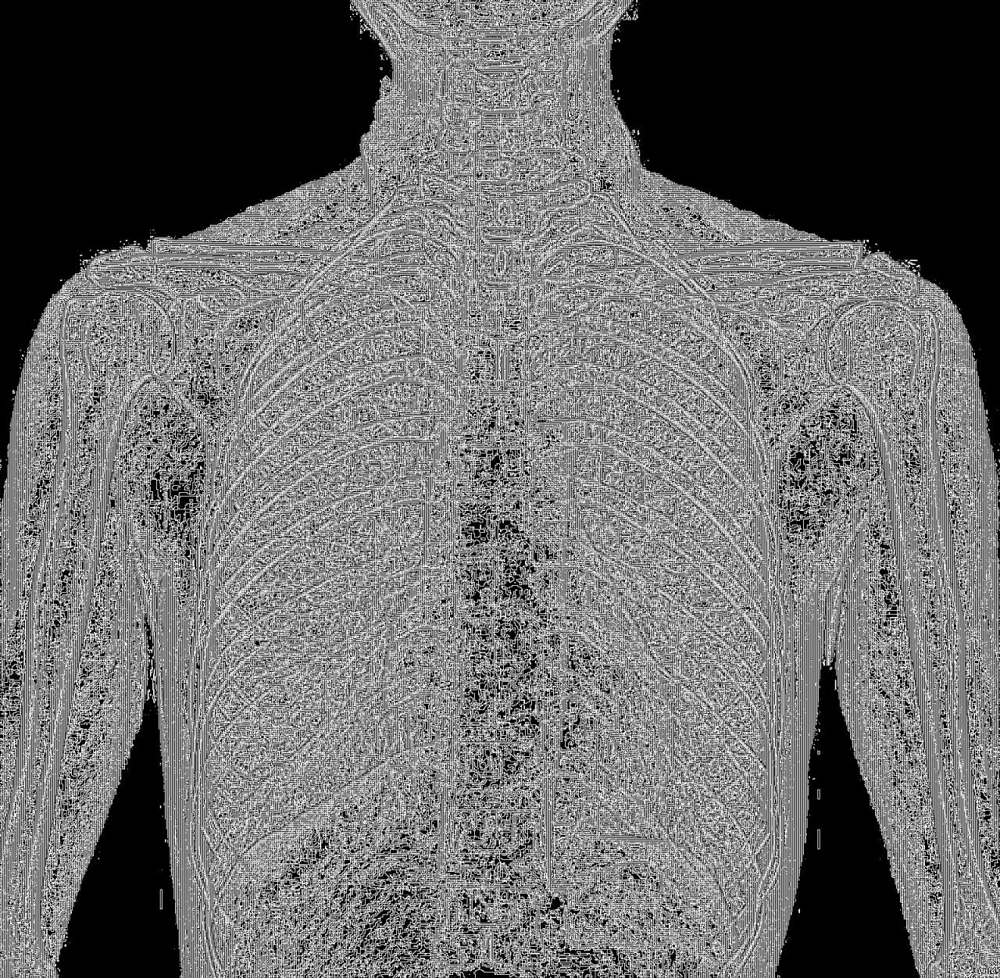

#### После "стирания бахромы":
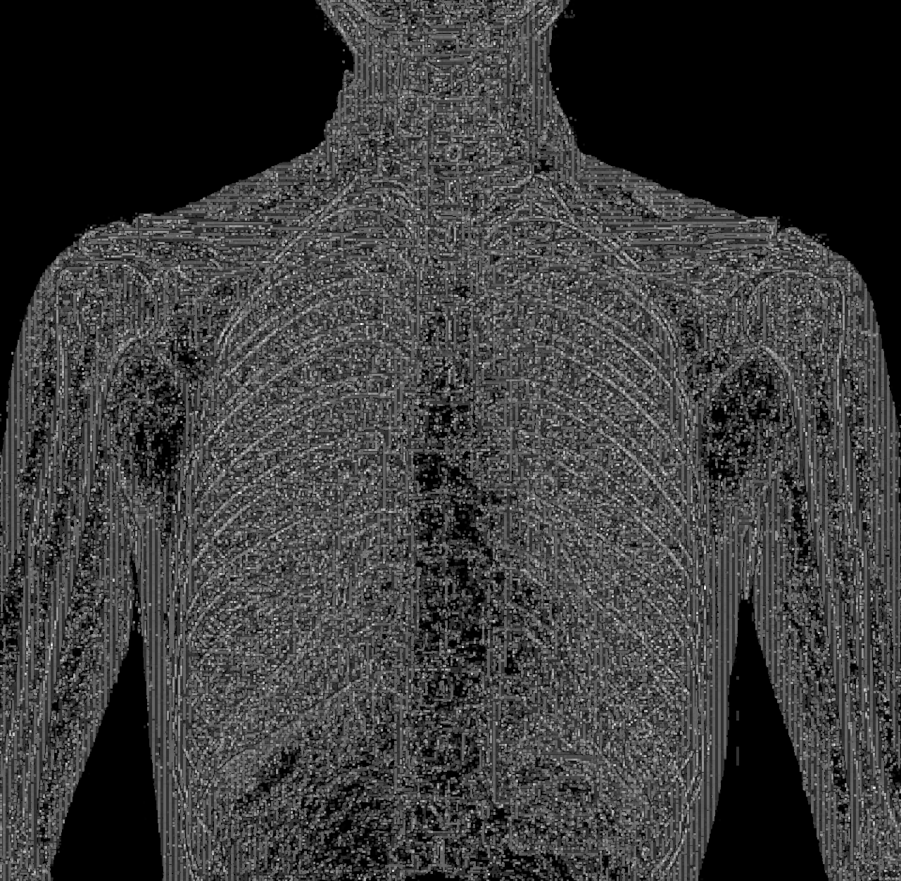

#### Разностное изображение
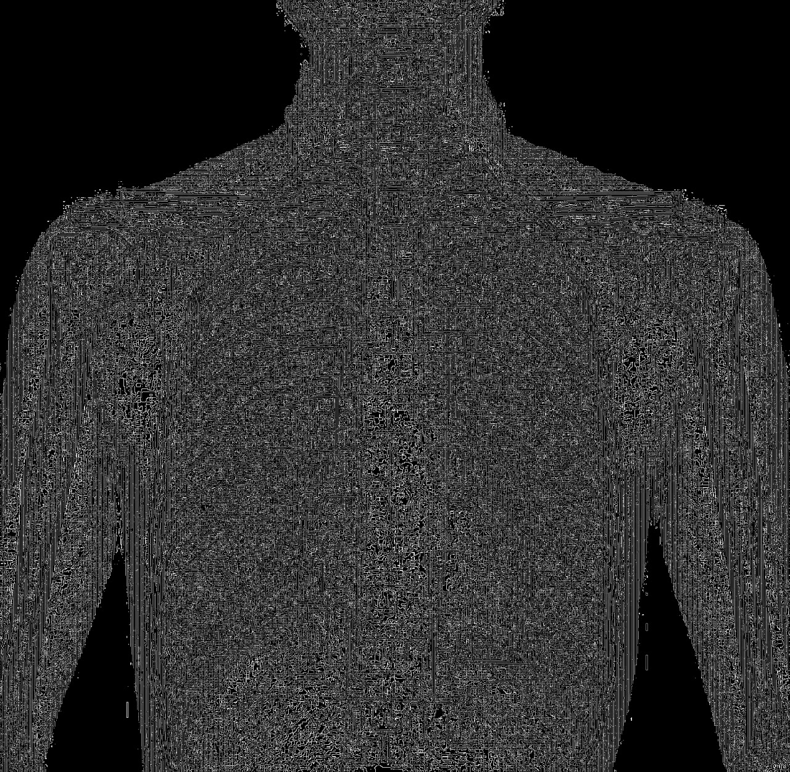

### Пример 5: Ghoul

#### Исходное:
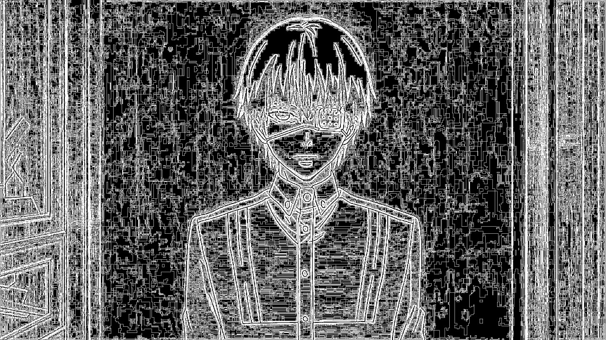

#### После "стирания бахромы":
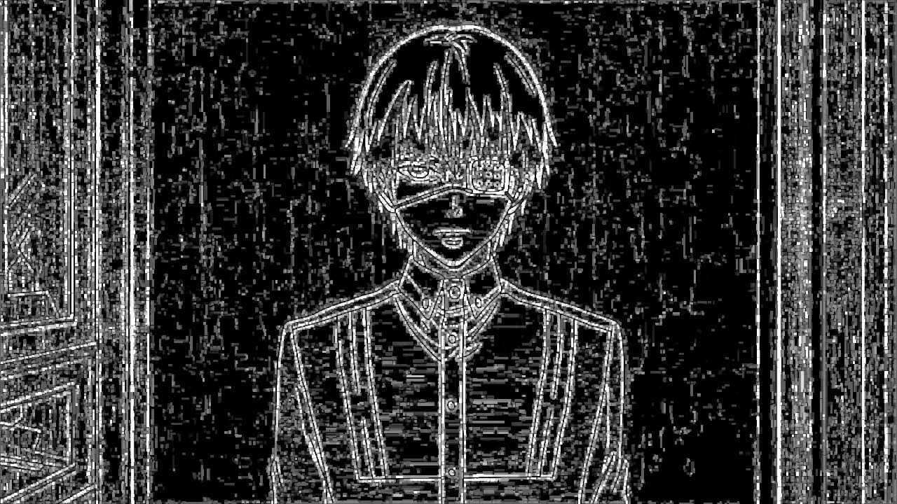

#### Разностное изображение
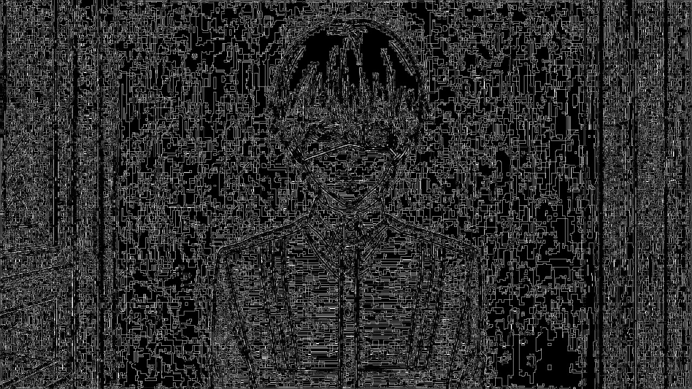

---

## Выводы

### Эффективность метода "стирание бахромы"
1. **Преимущества**:
   - Успешно удаляет мелкие артефакты, шум и "бахрому" по краям объектов.
   - Сохраняет основные геометрические характеристики объектов.
   - Подходит для предобработки изображений перед OCR или сегментацией.

2. **Недостатки**:
   - При большом размере структурного элемента (>>3×3) может "съедать" мелкие детали.
   - Не эффективен для удаления крупных дефектов (например, пятен).

3. **Рекомендации**:
   - Для изображений с высоким уровнем шума комбинировать с медианной фильтрацией.
   - Экспериментировать с формой структурного элемента (круг, крест) для разных типов текстур.

### Заключение
Морфологическое открытие с окном 3×3 — эффективный метод для коррекции изображений с мелкими артефактами. Разностное изображение позволяет наглядно оценить качество обработки и выявить переусердствование в фильтрации.