# Лабораторная работа №5. Выделение признаков символов

## Символ - а

### Фото прямой буквы
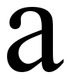

### Фото инвертированной буквы

### Профили буквы
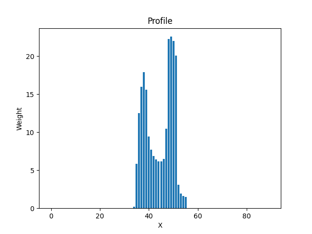
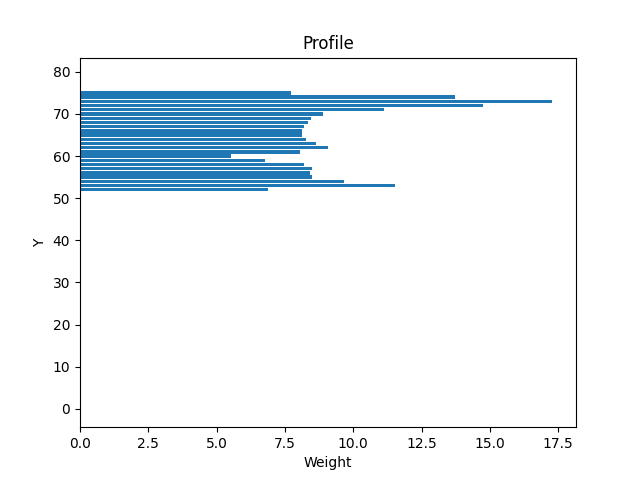

### Признаки:
1. Вес I - 0.0
2. Относительный вес I - 0.0
3. Вес II - 0.0
4. Относительный вес II - 0.0
5. Вес III - 104.65882352941176
6. Относительный вес III - 0.0581437908496732
7. Вес IV - 118.05098039215686
8. Относительный вес IV - 0.0655838779956427
9. Общий вес - 222.7098039215686
10. Относительный общий вес - 0.030931917211328975
11. Центр тяжести Y - 64.38974485393813
12. Центр тяжести X - 44.2951524009086
13. Относительный центр тяжести Y - 0.8048718106742265
14. Относительный центр тяжести X - 0.49216836001009556
15. Момент инерции Y - 6861.986884141059
16. Момент инерции X - 11604.71132314876
17. Относительный момент инерции Y - 0.0001176609548035161
18. Относительный момент инерции X - 0.00025183835336694356

## Символ - б

### Фото прямой буквы
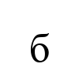

### Фото инвертированной буквы
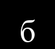

### Профили буквы
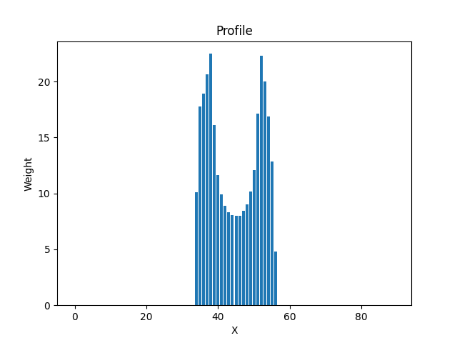
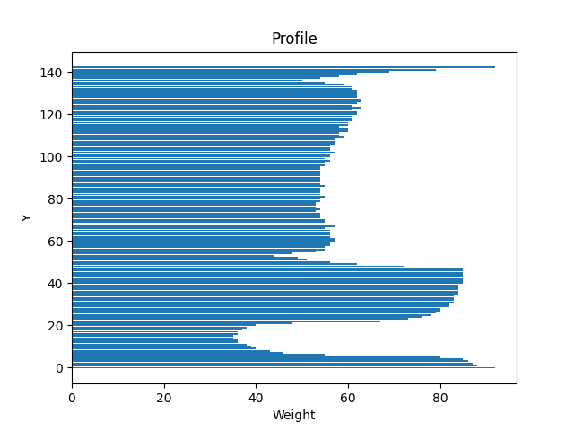

### Признаки:
1. Вес I - 25.458823529411763
2. Относительный вес I - 0.014143790849673201
3. Вес II - 40.56078431372549
4. Относительный вес II - 0.022533769063180827
5. Вес III - 127.44313725490196
6. Относительный вес III - 0.07080174291938998
7. Вес IV - 109.25490196078431
8. Относительный вес IV - 0.06069716775599128
9. Общий вес - 302.7176470588235
10. Относительный общий вес - 0.04204411764705882
11. Центр тяжести Y - 50.94364774008006
12. Центр тяжести X - 44.596789864365945
13. Относительный центр тяжести Y - 0.6367955967510007
14. Относительный центр тяжести X - 0.4955198873818438
15. Момент инерции Y - 14882.17680207212
16. Момент инерции X - 34313.47791242882
17. Относительный момент инерции Y - 0.00025518135806022155
18. Относительный момент инерции X - 0.000744650128307917

## Символ - в

### Фото прямой буквы
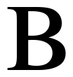

### Фото инвертированной буквы
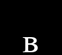

### Профили буквы
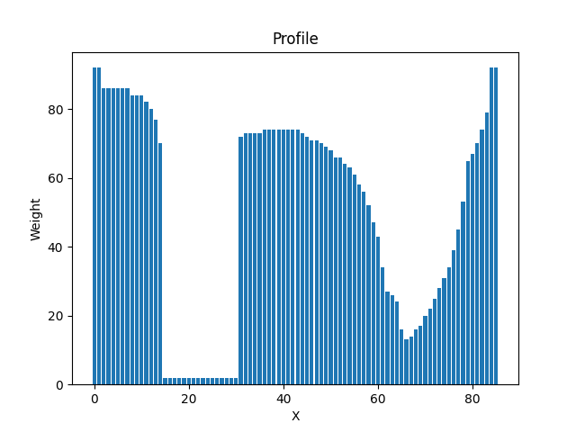
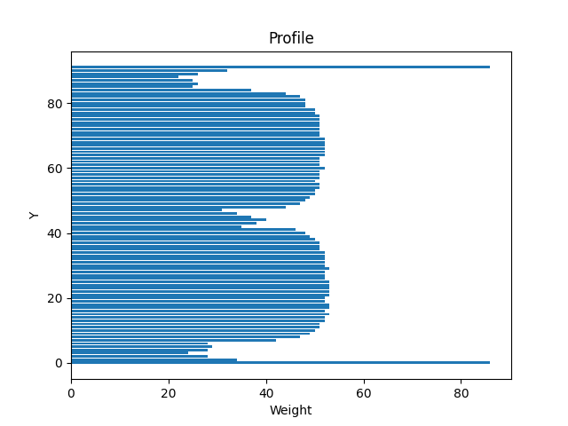

### Признаки:
1. Вес I - 0.0
2. Относительный вес I - 0.0
3. Вес II - 0.0
4. Относительный вес II - 0.0
5. Вес III - 128.30196078431374
6. Относительный вес III - 0.07127886710239652
7. Вес IV - 114.48627450980392
8. Относительный вес IV - 0.06360348583877995
9. Общий вес - 242.78823529411767
10. Относительный общий вес - 0.03372058823529412
11. Центр тяжести Y - 64.56514997334885
12. Центр тяжести X - 43.858393500347276
13. Относительный центр тяжести Y - 0.8070643746668607
14. Относительный центр тяжести X - 0.48731548333719193
15. Момент инерции Y - 8180.562885558998
16. Момент инерции X - 11043.219480715676
17. Относительный момент инерции Y - 0.00014027028267419407
18. Относительный момент инерции X - 0.0002396532005363645

## Символ - г

### Фото прямой буквы

### Фото инвертированной буквы
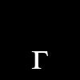

### Профили буквы
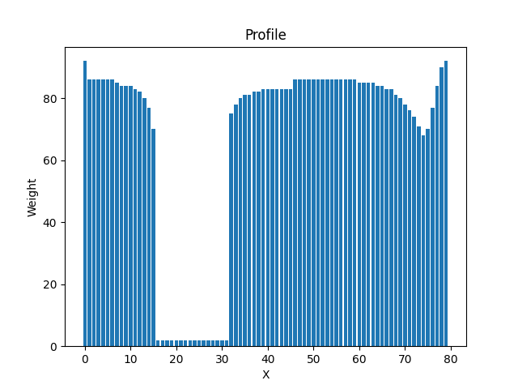
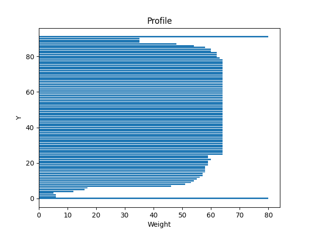

### Признаки:
1. Вес I - 0.0
2. Относительный вес I - 0.0
3. Вес II - 0.0
4. Относительный вес II - 0.0
5. Вес III - 110.78039215686275
6. Относительный вес III - 0.06154466230936819
7. Вес IV - 27.772549019607844
8. Относительный вес IV - 0.015429193899782135
9. Общий вес - 138.5529411764706
10. Относительный общий вес - 0.019243464052287582
11. Центр тяжести Y - 62.81973337861934
12. Центр тяжести X - 42.11001669921598
13. Относительный центр тяжести Y - 0.7852466672327417
14. Относительный центр тяжести X - 0.46788907443573313
15. Момент инерции Y - 2795.252412118225
16. Момент инерции X - 7662.811301523241
17. Относительный момент инерции Y - 4.792956810902306e-05
18. Относительный момент инерции X - 0.00016629364803652868

## Символ - д

### Фото прямой буквы
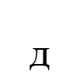

### Фото инвертированной буквы

### Профили буквы
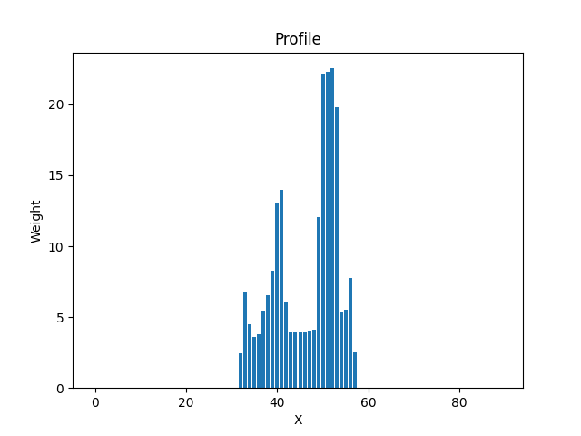
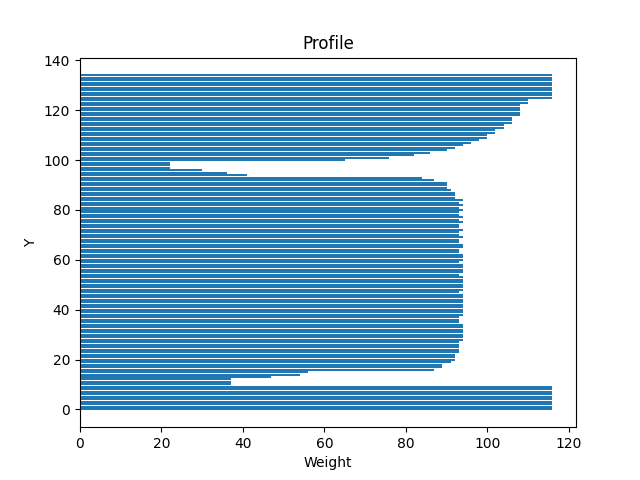

### Признаки:
1. Вес I - 0.0
2. Относительный вес I - 0.0
3. Вес II - 0.0
4. Относительный вес II - 0.0
5. Вес III - 82.50588235294117
6. Относительный вес III - 0.04583660130718954
7. Вес IV - 136.16470588235293
8. Относительный вес IV - 0.0756470588235294
9. Общий вес - 218.6705882352941
10. Относительный общий вес - 0.030370915032679736
11. Центр тяжести Y - 63.59719158551676
12. Центр тяжести X - 46.507720449776734
13. Относительный центр тяжести Y - 0.7949648948189595
14. Относительный центр тяжести X - 0.5167524494419637
15. Момент инерции Y - 9953.085985672044
16. Момент инерции X - 15346.47654981291
17. Относительный момент инерции Y - 0.00017066333994636564
18. Относительный момент инерции X - 0.0003330398556817038

## Вывод по работе
В ходе выполнения лабораторной работы были выделены признаки символов русского алфавита. Для каждого символа были рассчитаны вес, относительный вес, координаты центра тяжести, моменты инерции и их нормированные значения. Также были построены профили X и Y для каждого символа. Полученные данные могут быть использованы для дальнейшего анализа и классификации символов.
