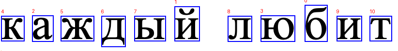
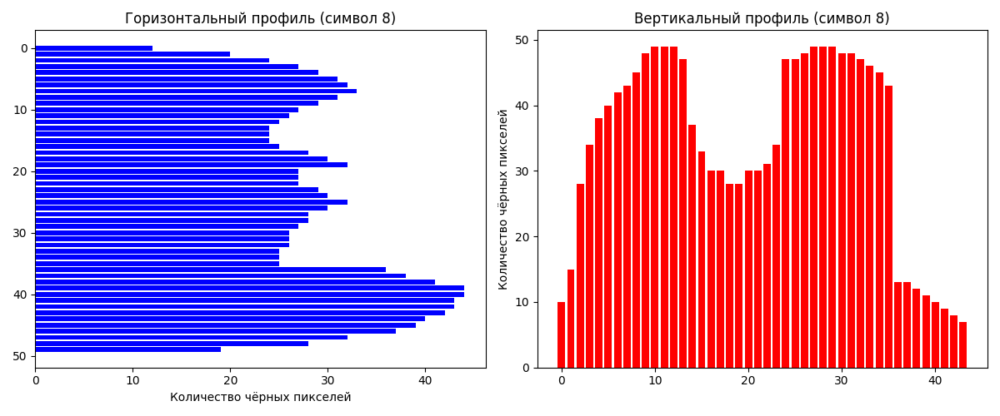

# Лабораторная работа №6. Сегментация текста

## Исходный скриншот

## Результаты сегментации

## Профили символов
В каталоге `pictures_results/` находятся все файлы сегментации, включая вырезанные изображения символов и их профили. Ниже представлены профили для каждой из букв:

1. **Буква "т"**  
   

2. **Буква "и"**  
   

3. **Буква "л"**  
   

4. **Буква "ы"**  
   

5. **Буква "д"**  
   

6. **Буква "ж"**  
   

7. **Буква "к"**  
   

8. **Буква "ю"**  
   

9. **Буква "а"**  
   

10. **Буква "б"**  
   
