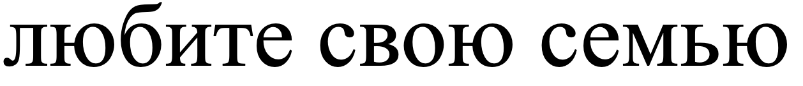
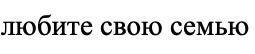

# Лабораторная работа №6. Классификация на основе признаков, анализ профилей

Лабораторная работа выполнена для:

- Алфавит - русский
- Тип букв - малые
- Шрифт - Times New Roman 
- Размер шрифта - 12 и 18

## Распознание символов того же шрифта

### Исходное изображение

### Классификация символов на основе известных признаков

Выводятся лучшие гипотезы

Выводятся лучшие гипотезы

 1. 'л' - 0.949312
 2. 'т' - 0.884484
 3. 'о' - 0.837234
 4. 'б' - 0.968388
 5. 'и' - 0.947535
 6. 'т' - 0.982510
 7. 'е' - 0.949220
 8. 'с' - 0.956018
 9. 'в' - 0.926722
10. 'о' - 0.932392
11. 'т' - 0.884484
12. 'о' - 0.837234
13. 'с' - 0.956018
14. 'е' - 0.949220
15. 'м' - 0.942374
16. 'ь' - 0.951456
17. 'т' - 0.884484
18. 'о' - 0.837234

### Результат

- Распознано : лтобите свото семьто
- Эталон     : любите свою семью
- Ошибок     : 6/17  |  Точность: 70.00%
- [✓] Файл с гипотезами → lab7/pictures_results/phrase_best_hypotheses.txt

### Исходное изображение

### Классификация символов на основе известных признаков

Выводятся лучшие гипотезы

 1. 'ё' - 0.788183
 2. 'т' - 0.883158
 3. 'т' - 0.734087
 4. 'о' - 0.752506
 5. 'б' - 0.856792
 6. 'и' - 0.669842
 7. 'а' - 0.000000
 8. 'т' - 0.883158
 9. 'е' - 0.771495
10. 'с' - 0.822394
11. 'в' - 0.584772
12. 'о' - 0.776077
13. 'т' - 0.734087
14. 'о' - 0.752506
15. 'с' - 0.822394
16. 'е' - 0.771495
17. 'к' - 0.652943
18. 'т' - 0.816045
19. 'ь' - 0.804976
20. 'у' - 0.735661
21. 'о' - 0.803609

### Результат

- Распознано : ё ттобиа т е свото сектьуо
- Эталон     : любите свою семью
- Ошибок     : 14/17  |  Точность: 46.15%
- [✓] Файл с гипотезами → lab7/pictures_results/phrase3_best_hypotheses.txt
- [✓] Готово, остальные результаты — в lab7/pictures_results