# Лабораторная работа №8  
## Тема: Текстурный анализ и контрастирование  

**Файл:** `kirp.png`  
**Метод:** GLCM (Gray-Level Co-occurrence Matrix)  
**Параметры:**
- Расстояние: `d = 1`
- Углы: `φ = 0°, 90°, 180°, 270°`
- Признак: `correlation`
- Контрастирование: нормализация яркости через HSV (V-канал)

---

## 1. Входные и выходные изображения

- 📥 Исходное изображение:  
  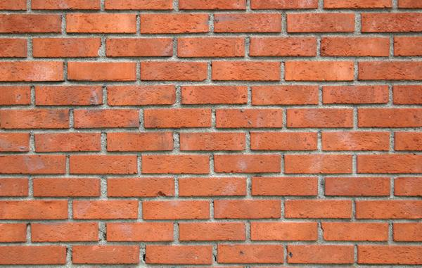

- 🖤 Полутоновое изображение (до контрастирования):  
  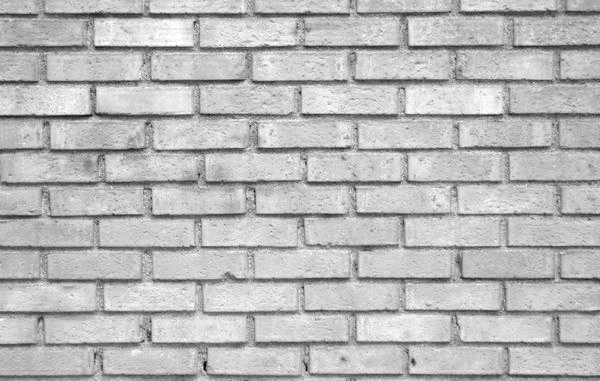

- 🤍 Полутоновое изображение (после контрастирования):  
  

---

## 2. Гистограммы яркости

- Сравнение гистограмм до и после контрастирования:  
  

Контрастирование значительно выровняло распределение яркости, растянув его на весь диапазон.

---

## 3. Матрицы GLCM и визуализация

Матрицы GLCM построены для направлений: `0°`, `90°`, `180°`, `270°`.

### До контрастирования:

- 
- 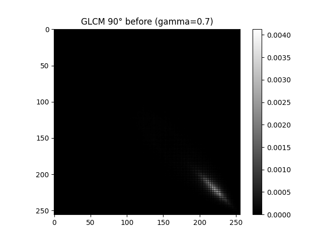
- 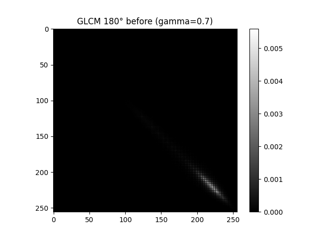
- 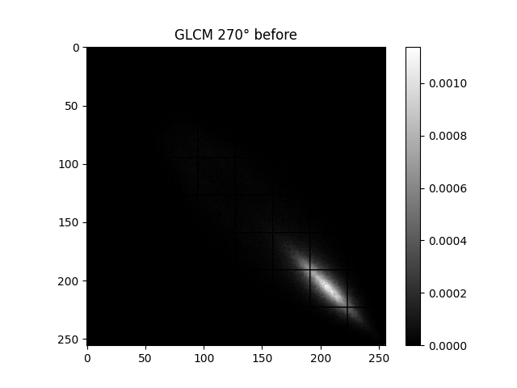

### После контрастирования:

- 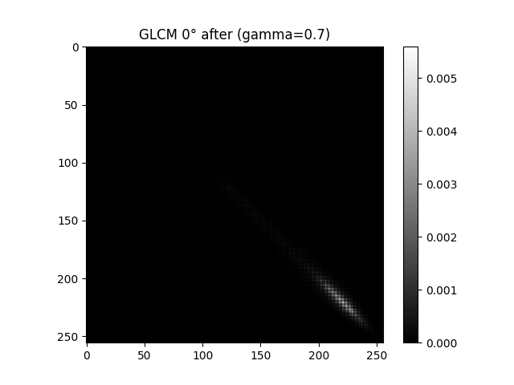
- 
- 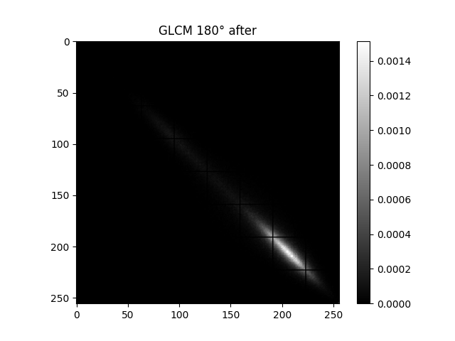
- 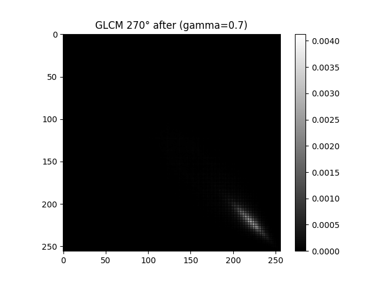

> Матрицы визуализированы в логарифмическом масштабе для лучшей читаемости.

---

## 4. Текстурные признаки (correlation)

```text
Файл: kirp.png
Correlation before contrast: [[0.98214194 0.96812973 0.97604088 0.97272074]]
Correlation after  contrast: [[0.99342601 0.98899165 0.99162825 0.98864645]]
```

**Файл:** `field.png`  
**Метод:** GLCM (Gray-Level Co-occurrence Matrix)  
**Параметры:**
- Расстояние: `d = 1`
- Углы: `φ = 0°, 90°, 180°, 270°`
- Признак: `correlation`
- Контрастирование: нормализация яркости через HSV (V-канал)

## 1. Входные и выходные изображения

- 📥 Исходное изображение:  
  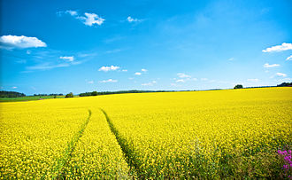

- 🖤 Полутоновое изображение (до контрастирования):  
  

- 🤍 Полутоновое изображение (после контрастирования):  
  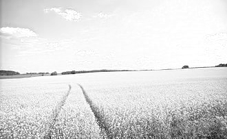

---

## 2. Гистограммы яркости

- Сравнение гистограмм до и после контрастирования:  
  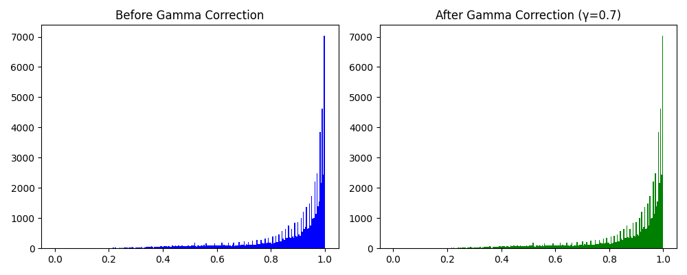

Контрастирование позволило выровнять распределение яркости, что может повысить эффективность текстурного анализа.

---

## 3. Матрицы GLCM и визуализация

Матрицы GLCM построены для направлений: `0°`, `90°`, `180°`, `270°`.

### До контрастирования:

- 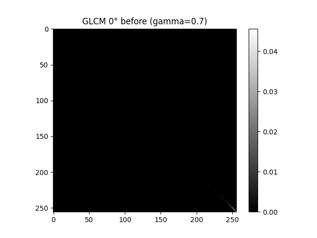
- 
- 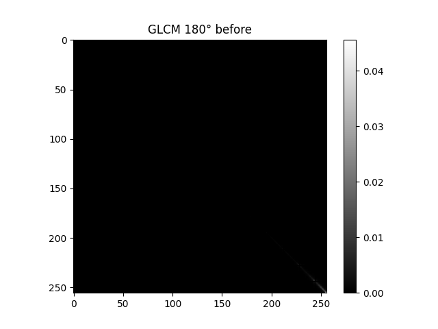
- 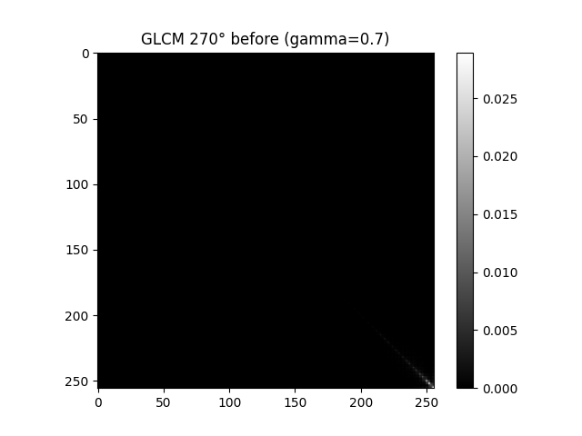

### После контрастирования:

- 
- 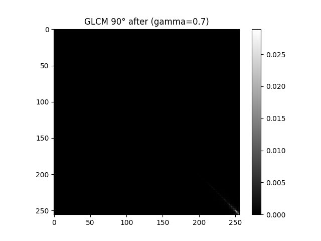
- 
- 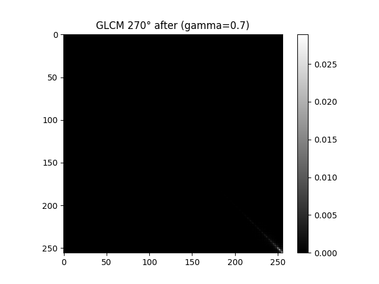

> Все матрицы визуализированы в логарифмическом масштабе.

---

## 4. Текстурные признаки (correlation)

```text
Файл: field.png
Correlation before contrast: [[0.97538465 0.98135147 0.97729104 0.97307811]]
Correlation after  contrast: [[0.99174803 0.9941015  0.9931268  0.99186592]]
