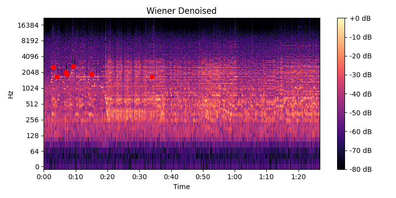
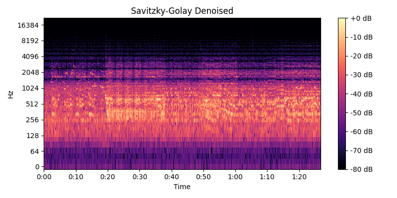

# Лабораторная работа №9. Анализ шума

Работа выполнялась для записи игры на пианино. Запись имела заметный фоновый шум. Построена спектрограмма, проведено устранение шума с помощью фильтра Винера и фильтра Cавицкого-Голея

## Спектрограмма исходного звука

## Спектрограмма после фильтра Винера

## Спектрограмма после фильтра Савоцкого

## Пики для Винера

1. Time: 15.052s, Frequency: 1894.92Hz, Amplitude: 14.30
2. Time: 6.885s, Frequency: 1981.05Hz, Amplitude: 13.10
3. Time: 15.064s, Frequency: 1851.86Hz, Amplitude: 12.62
4. Time: 7.303s, Frequency: 1851.86Hz, Amplitude: 10.35
5. Time: 9.201s, Frequency: 2670.12Hz, Amplitude: 9.89
6. Time: 34.017s, Frequency: 1679.59Hz, Amplitude: 8.56
7. Time: 4.145s, Frequency: 1679.59Hz, Amplitude: 7.90
8. Time: 7.291s, Frequency: 1894.92Hz, Amplitude: 7.86
9. Time: 2.990s, Frequency: 2540.92Hz, Amplitude: 7.12
10. Time: 6.891s, Frequency: 2024.12Hz, Amplitude: 5.96

## Пики для Савоцкого

1. Time: 75.668s, Frequency: 602.93Hz, Amplitude: 3.16
2. Time: 75.656s, Frequency: 559.86Hz, Amplitude: 2.68
3. Time: 51.020s, Frequency: 559.86Hz, Amplitude: 2.30
4. Time: 51.183s, Frequency: 602.93Hz, Amplitude: 2.22
5. Time: 36.107s, Frequency: 602.93Hz, Amplitude: 2.14
6. Time: 36.119s, Frequency: 646.00Hz, Amplitude: 2.08
7. Time: 19.348s, Frequency: 646.00Hz, Amplitude: 2.04
8. Time: 20.021s, Frequency: 301.46Hz, Amplitude: 2.02
9. Time: 51.020s, Frequency: 602.93Hz, Amplitude: 2.02
10. Time: 51.136s, Frequency: 559.86Hz, Amplitude: 2.00
