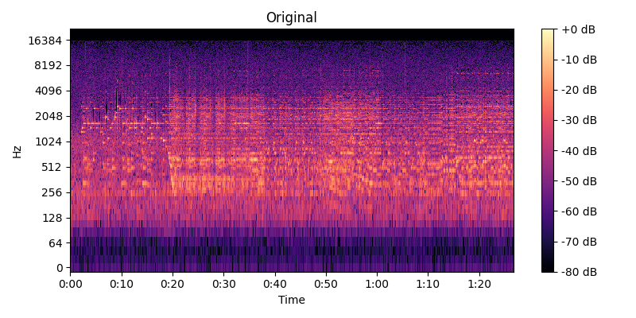

# Лабораторная работа №9. Анализ шума

Работа выполнялась для записи игры на пианино. Запись имела заметный фоновый шум. Построена спектрограмма, проведено устранение шума с помощью фильтра Винера и фильтра Cавицкого-Голея

## Спектрограмма исходного звука

## Спектрограмма после фильтра Винера

## Спектрограмма после фильтра Савоцкого

